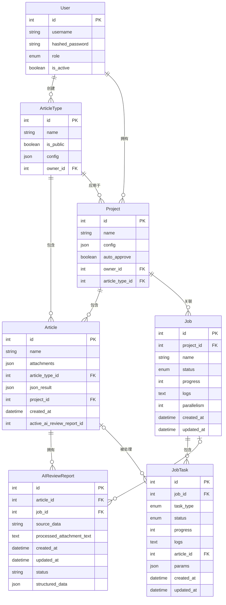

# 数据库ER图

下面是系统数据库实体关系图，使用Mermaid语法生成：

## 数据库关系说明

1. **User(用户)** - 系统用户，可以创建文章类型和项目
2. **ArticleType(文章类型)** - 定义了不同类型的文章及其处理配置
3. **Project(项目)** - 包含多个文章的集合，基于特定的文章类型
4. **Article(文章)** - 系统中的主要内容实体，属于特定项目和文章类型
5. **AIReviewReport(AI审阅报告)** - 存储AI对文章的审阅结果
6. **Job(任务)** - 处理项目中文章的任务
7. **JobTask(任务项)** - 具体任务的子任务，如处理上传、转换文档等

主要关系:
- 用户创建文章类型和项目
- 项目基于特定文章类型并包含多个文章
- 文章可以有多个AI审阅报告
- 任务关联到项目并包含多个子任务
- 任务可能生成AI审阅报告
- 子任务可能处理特定文章 