```mermaid
graph TD
    %% 根目录
    Root[TAI] --> Frontend[frontend/]
    Root --> Backend[app/]
    Root --> Alembic[alembic/]
    Root --> Data[data/]
    Root --> ConfigFiles[配置文件]

    %% 前端部分
    Frontend --> FrontendSrc[src/]
    Frontend --> FrontendPublic[public/]
    Frontend --> FrontendBuild[build/]
    Frontend --> FrontendConfig["package.json
    pnpm-lock.yaml
    README.md"]

    %% 后端部分
    Backend --> MainPy[main.py]
    Backend --> ModelsPy[models.py]
    Backend --> SchemasPy[schemas.py]
    Backend --> TasksPy[tasks.py]
    Backend --> AuthPy[auth.py]
    Backend --> DatabasePy[database.py]
    Backend --> FileConverterPy[file_converter.py]
    Backend --> SeedDBPy[seed_db.py]

    %% Alembic迁移
    Alembic --> Versions[versions/]
    Alembic --> EnvPy[env.py]
    Alembic --> ScriptMako[script.py.mako]

    %% 数据目录
    Data --> SQLiteDB[sql_app.db]
    Data --> RedisDB[dump.rdb]
    Data --> Uploads[uploads/]

    %% 配置文件
    ConfigFiles --> AlembicINI[alembic.ini]
    ConfigFiles --> DockerFiles["Dockerfile
    docker_build.sh
    docker_run.sh"]
    ConfigFiles --> Requirements[requirements.txt]
    ConfigFiles --> Scripts["run.py
    worker.py
    reset_db.sh
    seed_db.sh
    run_worker.sh"]

    %% 样式定义
    classDef default fill:#f9f9f9,stroke:#333,stroke-width:1px
    classDef frontend fill:#d4e6f1,stroke:#2874a6
    classDef backend fill:#d5f5e3,stroke:#1e8449
    classDef config fill:#fad7a0,stroke:#d35400
    classDef data fill:#d2b4de,stroke:#884ea0

    %% 应用样式
    class Frontend,FrontendSrc,FrontendPublic,FrontendBuild,FrontendConfig frontend
    class Backend,MainPy,ModelsPy,SchemasPy,TasksPy,AuthPy,DatabasePy,FileConverterPy,SeedDBPy backend
    class ConfigFiles,AlembicINI,DockerFiles,Requirements,Scripts config
    class Data,SQLiteDB,RedisDB,Uploads data
```

### 文件结构说明

1. **前端目录 (frontend/)**
   - src/: 源代码目录
   - public/: 静态资源
   - build/: 构建输出
   - 配置文件: package.json, pnpm-lock.yaml, README.md

2. **后端目录 (app/)**
   - main.py: 主应用入口
   - models.py: 数据模型
   - schemas.py: 数据校验模式
   - tasks.py: 异步任务
   - auth.py: 认证相关
   - database.py: 数据库配置
   - file_converter.py: 文件转换
   - seed_db.py: 数据库种子数据

3. **数据库迁移 (alembic/)**
   - versions/: 迁移文件
   - env.py: 迁移环境配置
   - script.py.mako: 迁移模板

4. **数据目录 (data/)**
   - sql_app.db: SQLite数据库
   - dump.rdb: Redis数据
   - uploads/: 上传文件存储

5. **配置文件**
   - alembic.ini: Alembic配置
   - Docker相关: Dockerfile及脚本
   - requirements.txt: Python依赖
   - 运行脚本: 各类服务启动和管理脚本