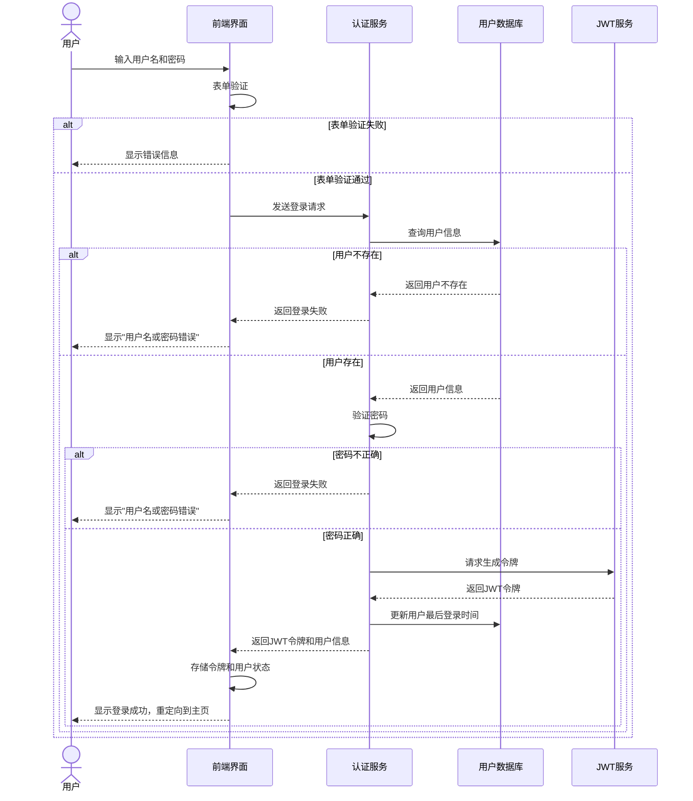

# 登录模块时序图

本文档使用Mermaid绘制了登录模块的时序图，展示了用户登录系统的完整流程。

## 登录流程时序图

## 说明

1. **用户操作**：用户在登录界面输入用户名和密码
2. **前端验证**：前端进行基本的表单验证（如字段非空、格式正确等）
3. **认证流程**：
   - 服务器查询用户数据库确认用户存在
   - 验证密码是否匹配
   - 生成JWT令牌用于后续请求的身份验证
4. **成功/失败处理**：
   - 失败时向用户展示适当的错误信息
   - 成功时更新用户登录状态并重定向到应用主页 