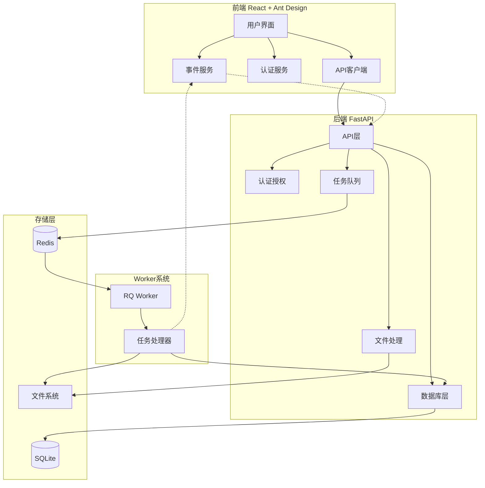

```mermaid
graph TD
    %% Frontend Components
    subgraph Frontend[前端 React + Ant Design]
        UI[用户界面]
        EventService[事件服务]
        AuthService[认证服务]
        ApiClient[API客户端]
    end

    %% Backend Components
    subgraph Backend[后端 FastAPI]
        API[API层]
        Auth[认证授权]
        DB[数据库层]
        TaskQueue[任务队列]
        FileHandler[文件处理]
    end

    %% Storage Layer
    subgraph Storage[存储层]
        SQLite[(SQLite)]
        Redis[(Redis)]
        FileSystem[文件系统]
    end

    %% Worker System
    subgraph Worker[Worker系统]
        RQWorker[RQ Worker]
        Tasks[任务处理器]
    end

    %% Interactions
    UI --> EventService
    UI --> AuthService
    UI --> ApiClient
    ApiClient --> API
    API --> Auth
    API --> DB
    API --> TaskQueue
    API --> FileHandler
    
    DB --> SQLite
    TaskQueue --> Redis
    FileHandler --> FileSystem
    
    Redis --> RQWorker
    RQWorker --> Tasks
    Tasks --> DB
    Tasks --> FileSystem

    %% Event Flows
    EventService -.-> API
    Tasks -.-> EventService
```