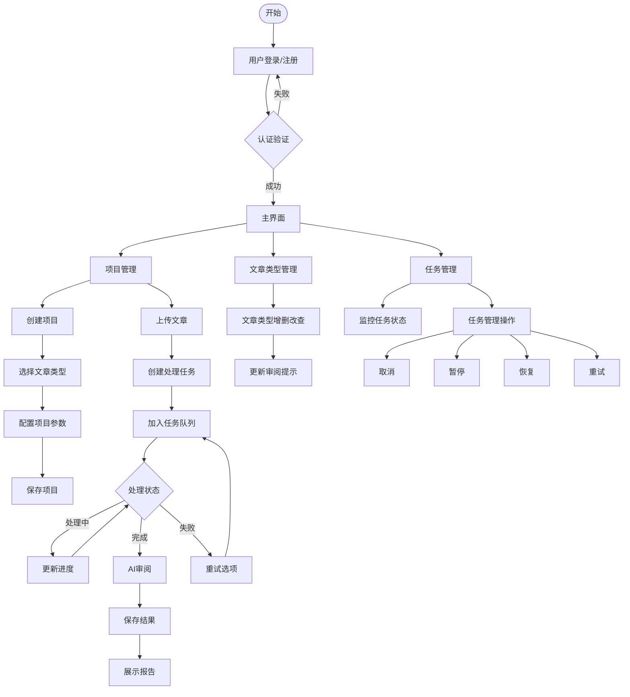

```mermaid
graph TD
    Start([开始]) --> Login[用户登录/注册]
    Login --> Auth{认证验证}
    Auth -->|失败| Login
    Auth -->|成功| Main[主界面]

    Main --> P[项目管理]
    Main --> AT[文章类型管理]
    Main --> J[任务管理]
    
    P --> PC[创建项目]
    PC --> SelectAT[选择文章类型]
    SelectAT --> ConfigP[配置项目参数]
    ConfigP --> SaveP[保存项目]
    
    P --> Upload[上传文章]
    Upload --> CreateJob[创建处理任务]
    CreateJob --> Queue[加入任务队列]
    Queue --> Process{处理状态}
    
    Process -->|处理中| UpdateProgress[更新进度]
    UpdateProgress --> Process
    
    Process -->|完成| AIReview[AI审阅]
    AIReview --> SaveResult[保存结果]
    SaveResult --> ShowReport[展示报告]
    
    Process -->|失败| RetryOption[重试选项]
    RetryOption --> Queue

    AT --> CRUD[文章类型增删改查]
    CRUD --> UpdatePrompt[更新审阅提示]
    
    J --> MonitorJobs[监控任务状态]
    J --> ManageJobs[任务管理操作]
    ManageJobs --> Cancel[取消]
    ManageJobs --> Pause[暂停]
    ManageJobs --> Resume[恢复]
    ManageJobs --> Retry[重试]
```