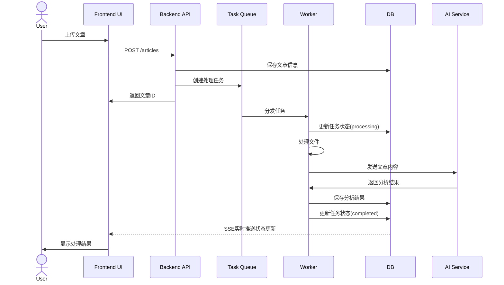

```mermaid
sequenceDiagram
    actor User
    participant UI as Frontend UI
    participant API as Backend API
    participant Queue as Task Queue
    participant Worker
    participant DB
    participant AI as AI Service

    User->>UI: 上传文章
    UI->>API: POST /articles
    API->>DB: 保存文章信息
    API->>Queue: 创建处理任务
    API->>UI: 返回文章ID
    Queue->>Worker: 分发任务
    Worker->>DB: 更新任务状态(processing)
    Worker->>Worker: 处理文件
    Worker->>AI: 发送文章内容
    AI->>Worker: 返回分析结果
    Worker->>DB: 保存分析结果
    Worker->>DB: 更新任务状态(completed)
    DB-->>UI: SSE实时推送状态更新
    UI->>User: 显示处理结果
```