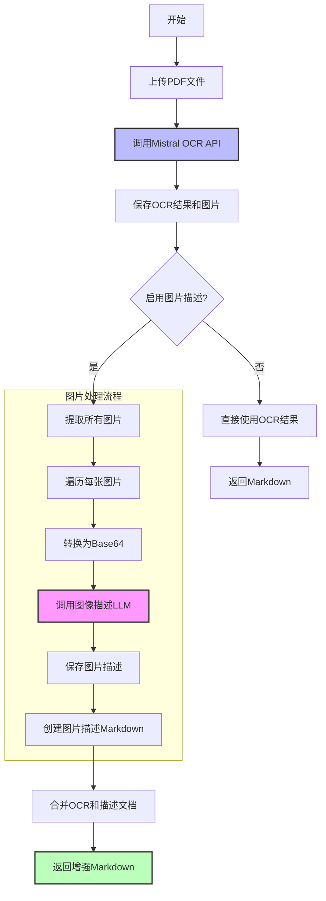
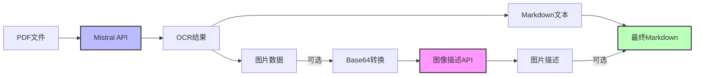

# AdvancedMarkdownConverter 核心业务流程

```mermaid
flowchart TD
    start[开始] --> upload[上传PDF文件]
    upload --> callOCR[调用Mistral OCR API]
    callOCR --> saveResults[保存OCR结果和图片]
    
    saveResults --> checkDesc{启用图片描述?}
    checkDesc -->|是| extractImages[提取所有图片]
    checkDesc -->|否| directReturn[直接使用OCR结果]
    
    extractImages --> loopImages[遍历每张图片]
    loopImages --> convertB64[转换为Base64]
    convertB64 --> callLLM[调用图像描述LLM]
    callLLM --> saveDesc[保存图片描述]
    saveDesc --> createMD[创建图片描述Markdown]
    createMD --> mergeDocs[合并OCR和描述文档]
    
    directReturn --> endA[返回Markdown]
    mergeDocs --> endB[返回增强Markdown]
    
    subgraph 图片处理流程
        extractImages
        loopImages
        convertB64
        callLLM
        saveDesc
        createMD
    end
    
    style callLLM fill:#f9f,stroke:#333,stroke-width:2px
    style callOCR fill:#bbf,stroke:#333,stroke-width:2px
    style endB fill:#bfb,stroke:#333,stroke-width:2px
```

## 数据流简图

```mermaid
flowchart LR
    PDF[PDF文件] --> API[Mistral API]
    API --> OCRData[OCR结果]
    
    OCRData --> Markdown[Markdown文本]
    OCRData --> Images[图片数据]
    
    Images --> |可选| convertB64[Base64转换]
    convertB64 --> ImgDescAPI[图像描述API]
    ImgDescAPI --> Descriptions[图片描述]
    
    Markdown --> FinalMD[最终Markdown]
    Descriptions --> |可选| FinalMD
    
    style API fill:#bbf,stroke:#333,stroke-width:2px
    style ImgDescAPI fill:#f9f,stroke:#333,stroke-width:2px
    style FinalMD fill:#bfb,stroke:#333,stroke-width:2px
``` 