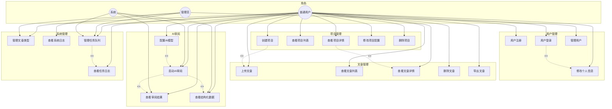

```mermaid
graph TD
    %% 角色定义
    subgraph Actors[角色]
        User((普通用户))
        Admin((管理员))
        System((系统))
    end

    %% 用例定义
    subgraph UserManagement[用户管理]
        UC1[用户注册]
        UC2[用户登录]
        UC3[修改个人信息]
        UC4[管理用户]
    end

    subgraph ProjectManagement[项目管理]
        UC5[创建项目]
        UC6[查看项目列表]
        UC7[查看项目详情]
        UC8[修改项目配置]
        UC9[删除项目]
    end

    subgraph ArticleManagement[文章管理]
        UC10[上传文章]
        UC11[查看文章列表]
        UC12[查看文章详情]
        UC13[删除文章]
        UC14[导出文章]
    end

    subgraph AIReview[AI审阅]
        UC15[启动AI审阅]
        UC16[查看审阅结果]
        UC17[查看结构化数据]
        UC18[配置AI模型]
    end

    subgraph SystemManagement[系统管理]
        UC19[管理文章类型]
        UC20[查看系统日志]
        UC21[管理任务队列]
        UC22[查看任务日志]
    end

    %% 角色与用例的关系
    User --> UC1
    User --> UC2
    User --> UC3
    User --> UC5
    User --> UC6
    User --> UC7
    User --> UC8
    User --> UC9
    User --> UC10
    User --> UC11
    User --> UC12
    User --> UC13
    User --> UC14
    User --> UC15
    User --> UC16
    User --> UC17
    User --> UC18
    User --> UC19
    User --> UC21
    User --> UC22

    Admin --> UC4
    Admin --> UC19
    Admin --> UC20
    Admin --> UC21

    System --> UC15
    System --> UC16
    System --> UC17
    System --> UC21

    %% 用例之间的关系
    UC2 -.->|<<include>>| UC3
    UC5 -.->|<<include>>| UC10
    UC7 -.->|<<include>>| UC12
    UC15 -.->|<<include>>| UC16
    UC15 -.->|<<include>>| UC17
    UC18 -.->|<<extend>>| UC15
    UC21 -.->|<<include>>| UC22
``` 