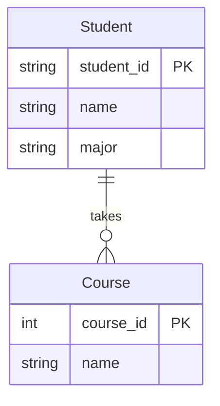

# Mermaid到Chen ER图转换工具

这个工具可以将Mermaid格式的ER图转换为传统的Chen符号ER图（使用DrawIO格式）。

## 功能特点

- 将Mermaid文本格式的ER图转换为可在DrawIO/diagrams.net中打开的XML文件
- 支持实体、属性和关系的转换
- 自动标记主键和关系的基数
- 美观的布局和样式

## 使用方法

1. 准备一个包含Mermaid ER图的Markdown文件，例如：

```markdown
# 示例ER图



2. 运行转换脚本：

```bash
python mermaid_to_chen_er.py 你的文件.md 输出文件.drawio
```

3. 在DrawIO或diagrams.net中打开生成的.drawio文件，查看和编辑转换后的Chen ER图。

## 支持的关系类型

工具支持以下Mermaid ER图中的关系类型转换：

- `||--||`: 一对一关系
- `||--o{` 或 `||--|{`: 一对多关系
- `o{--||` 或 `|{--||`: 多对一关系

## 示例

1. 创建Mermaid ER图文本
2. 保存为Markdown文件
3. 执行转换：`python mermaid_to_chen_er.py student_er.md student_er.drawio`
4. 在DrawIO中打开student_er.drawio文件

## 注意事项

- 实体名称和属性必须遵循Mermaid ER图的语法规则
- 主键属性通过"PK"标记
- 关系必须有一个名称，使用双引号或不使用引号均可

## 开发者信息

该工具使用Python开发，主要依赖标准库：
- xml.etree.ElementTree
- xml.dom.minidom
- re (正则表达式)
- math

## 后续改进计划

- 支持更多类型的关系和基数
- 允许自定义实体和属性的样式
- 提供交互式的布局调整选项
- 开发Web界面

## 许可证

MIT许可证 