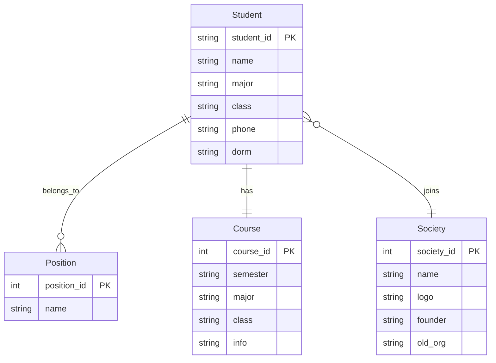

# 示例ER图

下面是一个示例的ER图，描述学生社团管理系统：

```mermaid
erDiagram
    Student {
        string student_id PK
        string name
        string major
        string class
        string phone
        string dorm
    }
    
    Society {
        int society_id PK
        string name
        string logo
        string founder
        string old_org
    }
    
    Course {
        int course_id PK
        string semester
        string major
        string class
        string info
    }
    
    Position {
        int position_id PK
        string name
    }
    
    Student ||--o{ Position : "belongs_to"
    Student ||--|| Course : "has"
    Student o{--|| Society : "joins"
``` 