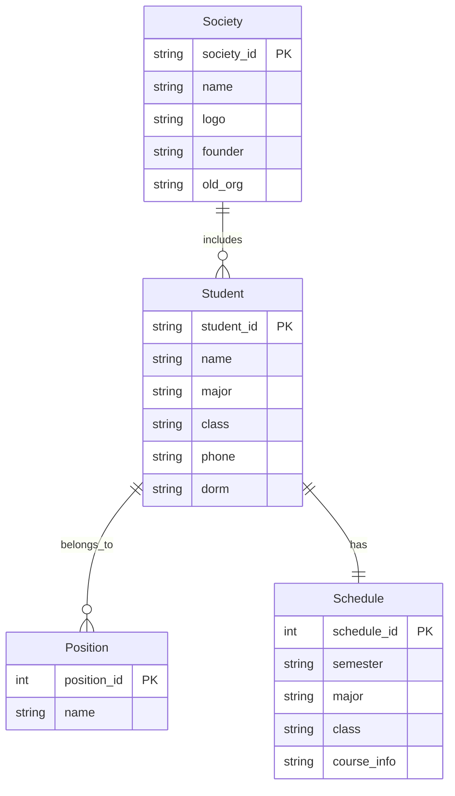

# 学生社团管理系统ER图

以下是学生社团管理系统的实体关系图：

```mermaid
erDiagram
    Society {
        string society_id PK
        string name
        string logo
        string founder
        string old_org
    }
    
    Position {
        int position_id PK
        string name
    }
    
    Student {
        string student_id PK
        string name
        string major
        string class
        string phone
        string dorm
    }
    
    Schedule {
        int schedule_id PK
        string semester
        string major
        string class
        string course_info
    }
    
    Student ||--o{ Position : "belongs_to"
    Society ||--o{ Student : "includes"
    Student ||--|| Schedule : "has"
``` 